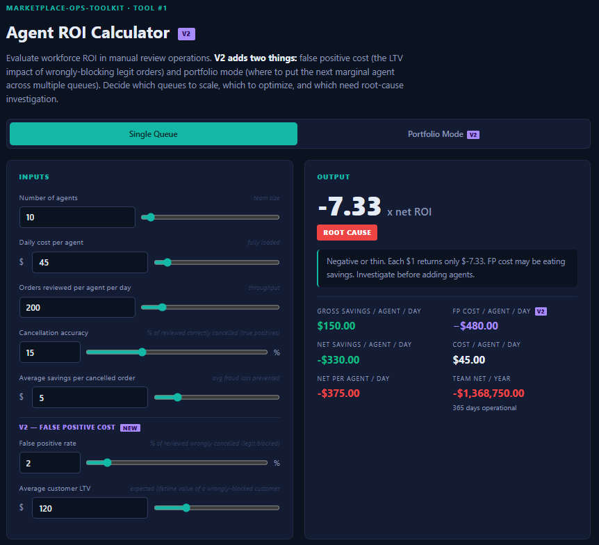
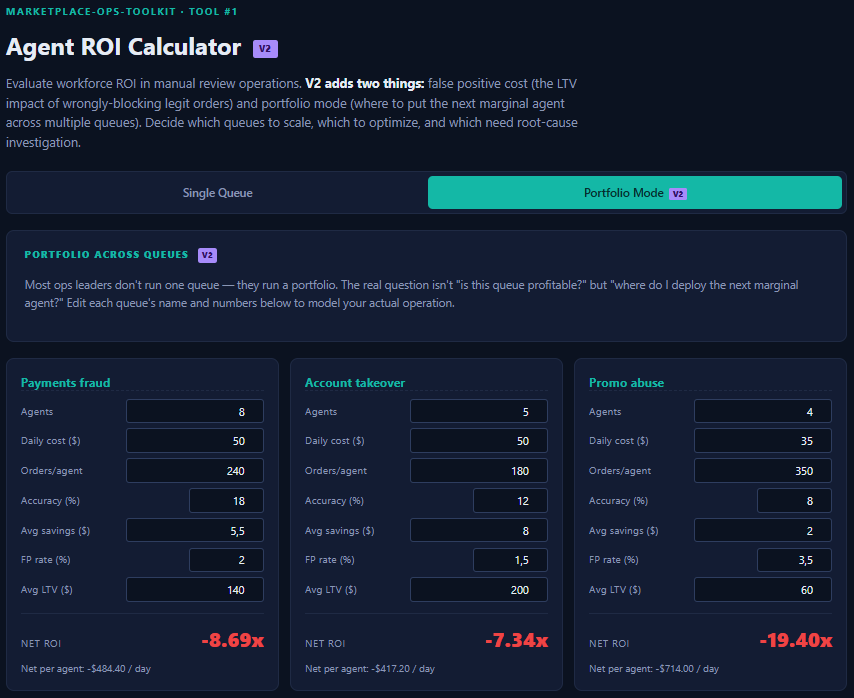
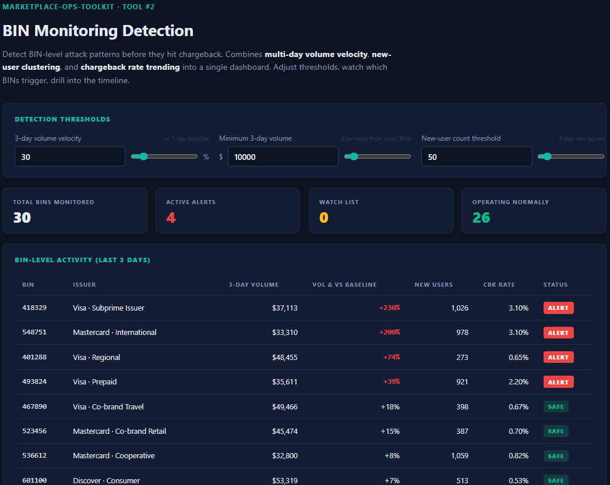
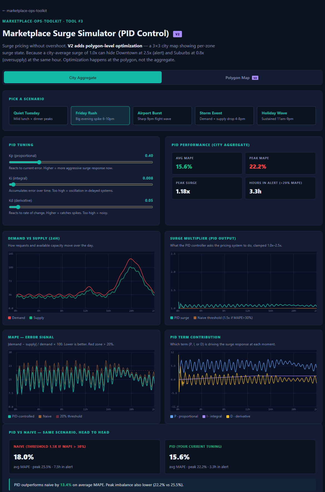
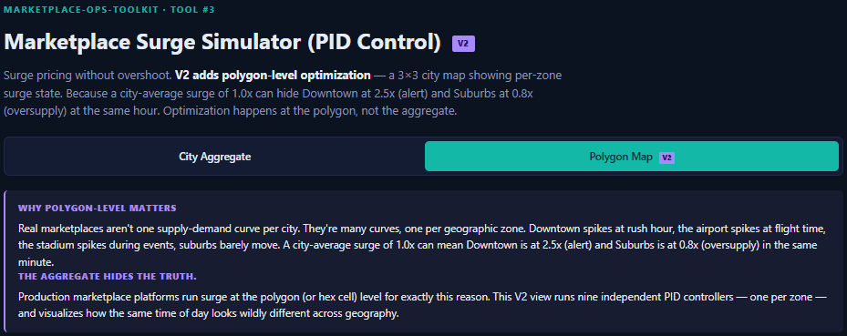
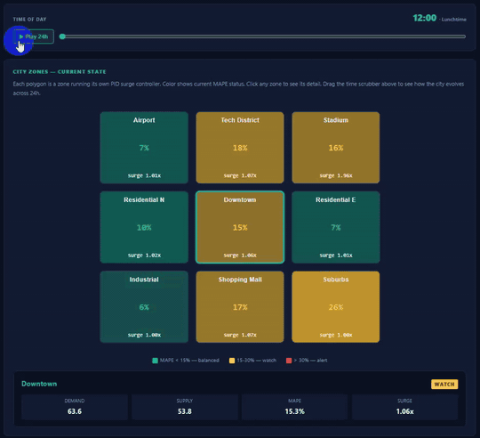
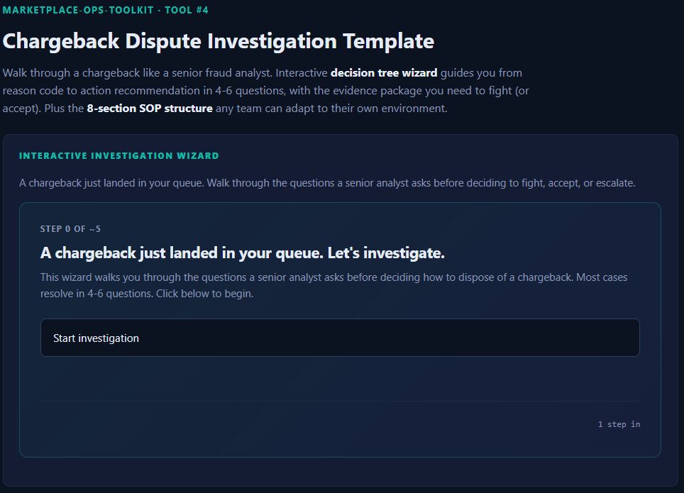
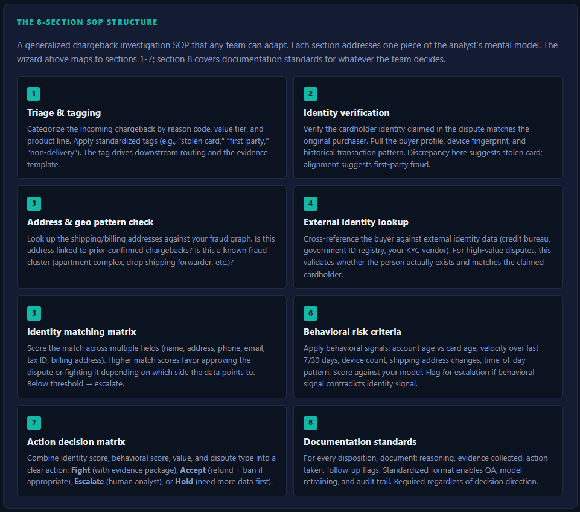
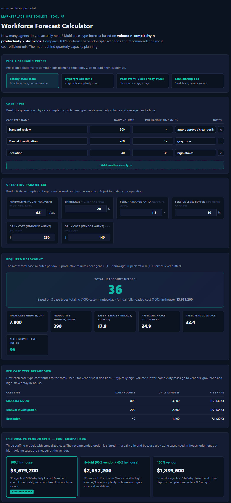

# Marketplace Ops Toolkit

> Practical tools for operations leaders running manual review queues — fraud, content moderation, customer service QA, anywhere humans decision flagged cases at scale.

Open-source methodologies for evaluating, scaling, and optimizing manual review operations. Drawn from years of hands-on work in fraud and marketplace operations across Latin America, sanitized and generalized so any ops leader can adapt them to their own context.

---

## Tools

### Tool #1 — Agent ROI Calculator (V2)

**[→ Open the calculator](./agent-roi.html)**




Evaluate workforce ROI in manual review operations. Helps you decide which queues to scale, which to optimize, and which need root-cause investigation before another dollar gets spent.

**V2 adds two things V1 missed:**

1. **False positive cost** — When an agent blocks a legitimate order, you don't just lose the savings, you lose the LTV of that customer. V2 takes FP rate + avg customer LTV as inputs and subtracts that cost from gross savings to give you net ROI.
2. **Portfolio mode** — Most ops leaders don't run one queue, they run multiple. V2 portfolio mode lets you model up to 3 queues side by side and surfaces which queue gets the next marginal agent. Real decision isn't "is queue X profitable?" but "where do I put the next dollar?"

Both features were raised as missing in V1 by [Ricardo Vieira-Gomes](https://www.linkedin.com/in/) (Co-Founder & Executive Director, ET Armadillo · AI Transformation in Operations) on the launch post. Both critiques were right and are now built in.

**What it does:**
- 7 inputs: team size, daily cost, throughput, accuracy, avg savings, **FP rate (V2)**, **avg customer LTV (V2)**
- Classifies the queue into 3 tiers: Scale / Optimize / Root cause (based on NET ROI after FP cost)
- Decomposes ROI against industry benchmarks across 5 levers (V1 had 4)
- Returns specific recommendation tied to whichever lever is dragging
- Pre-loaded with 6 illustrative scenarios including a "FP-bleeding queue" that flips ROI negative
- **Portfolio mode** lets you compare 3 queues + see marginal allocation recommendation

**Why this exists:** Most teams scale manual review headcount linearly with volume, which is how ops budgets explode and quality drops at the same time. The math to evaluate workforce ROI is simple once you frame it right — what isn't simple is asking the question every quarter and using the answer to decide.

**The formula:**

```
Agent ROI = (Orders reviewed × Accuracy × Avg savings per cancellation) ÷ Daily cost
```

**The tiers:**

| ROI | Action | Reasoning |
|---|---|---|
| ≥ 1.0 | **Scale** | Each $1 in agent cost generates $1+ in savings. Add headcount, expand case mix, raise the bar on what flows to the queue. |
| 0.5 – 1.0 | **Optimize** | Marginal. Tune one lever before adding people. Usually accuracy or orders/agent. |
| < 0.5 | **Root cause** | Negative ROI. More agents amplify the loss. Investigate rule precision, tooling, training, or whether this case type belongs in a queue at all. |

---

## Use cases (beyond fraud)

The same logic applies anywhere a manual review queue exists with measurable savings per intervention:

- **Fraud operations** — agents reviewing flagged transactions
- **Content moderation** — reviewers actioning flagged user content
- **Customer service quality assurance** — supervisors auditing agent calls/tickets
- **KYC and compliance review** — analysts processing onboarding flags
- **Chargeback dispute investigation** — agents deciding fight vs accept
- **Returns and refunds verification** — agents validating high-value claims

If your team has a queue and the cost of letting bad stuff through is measurable, this tool gives you a structured way to evaluate the economics.

---

### Tool #2 — BIN Monitoring Detection

**[→ Open the dashboard](./bin-monitor.html)** · [Python reference](./bin-monitor-reference.py)



Detect BIN-level attack patterns before they hit chargeback. BIN attacks (where fraudsters generate card numbers within stolen BIN ranges and test them at scale) cause damage 30–90 days before chargebacks land. This tool catches them in real time.

**What it does:**
- Aggregates per-BIN activity across a 7-day window
- Combines three independent signals: volume velocity, volume floor, new-user clustering
- Classifies each BIN: Safe / Watch / Alert
- Drill-down view shows day-by-day timeline for any BIN
- Adjustable thresholds for tuning to your traffic baseline
- Includes a Python reference implementation for adapting to your data pipeline

**The detection rule:**

```
ALERT IF (volume velocity > X%) AND (3-day volume > floor) AND (new-user count > threshold)
```

**Status tiers:**

| Tier | Logic | Action |
|---|---|---|
| **Alert** | All three signals cross | Pull human investigator. Tighten rules on this BIN range. |
| **Watch** | Velocity elevated + one of (volume floor or new users) | Track daily, no ops response yet. |
| **Safe** | Velocity normal or only one signal | No action. Stable large BINs land here even when above floor — that's intentional. |

Why **AND** instead of OR? Volume velocity alone triggers on Black Friday. New-user count alone triggers on marketing campaigns. The intersection is where actual attacks separate from legitimate traffic.

---

### Tool #3 — Marketplace Surge Simulator (PID Control) — V2

**[→ Open the simulator](./surge-pid.html)** · [Python reference](./surge-pid-reference.py)





Interactive simulator of surge pricing using **PID control theory**, with two modes:

**City Aggregate mode (V1):** single PID over a city-wide demand/supply curve. Watch the controller respond to 5 realistic scenarios, tune Kp/Ki/Kd, compare against a naive threshold-based surge rule.

**Polygon Map mode (V2 — new):** nine independent PID controllers running on a 3×3 city map. Each zone (Airport, Tech District, Stadium, Residential N/E, Downtown, Industrial, Shopping Mall, Suburbs) has its own demand profile and its own surge multiplier. The visualization shows how the same time of day looks wildly different across geography — Airport at 9pm hitting 2.5x surge while Suburbs sits at 1.0x, both at the same minute. A time scrubber lets you watch the heatmap evolve across 24 hours. The comparison panel quantifies how polygon-level PID outperforms a single city-level PID applied uniformly across all zones.

**Why polygon-level matters:** production surge systems at ride-hail and delivery platforms (Uber's H3 hex framework, Lyft zones, DoorDash dispatch cells) operate at the polygon/cell level for one reason — city averages hide local imbalance. A 1.0x city surge can be the average of Downtown at 2.5x and Suburbs at 0.8x. Optimize the average, and Downtown riders wait too long while Suburb drivers sit idle. Optimize each zone, and both problems disappear.

**What it does:**
- Simulates 24 hours of marketplace activity (5-minute ticks) for 5 scenarios
- Implements a full PID controller (Proportional, Integral, Derivative terms)
- Models supply response with realistic delay (15 minutes for drivers to come online)
- Lets you tune Kp, Ki, Kd via sliders and watch 4 charts update in real time
- Compares PID vs naive threshold rule on average MAPE, peak MAPE, alert hours
- Includes a 200-line Python reference implementation for production adaptation

**The five scenarios:**

| Scenario | Pattern | What it tests |
|---|---|---|
| Quiet Tuesday | Mild lunch + dinner peaks | Steady-state controller |
| Friday Rush | Big evening spike 6-10pm | Anticipation of predictable surge |
| Airport Burst | Sharp 9pm flight wave | Spike response (D term shines) |
| Storm Event | Demand spike + supply drop | Hardest case — both controllers struggle |
| Holiday Wave | Sustained high demand 11am-9pm | Long-horizon balance |

**Why PID over a threshold rule?**

A naive rule (`surge = 1.5x if MAPE > 30%, else 1.0x`) is on/off — surge flips chaotically as the error crosses the threshold. Drivers see unpredictable prices, riders see surprises, ops teams see noise. PID gives **smooth, proportional response** that builds up gradually, anticipates change, and decays cleanly when imbalance resolves.

With the loaded defaults (Kp=0.4, Ki=0.008, Kd=0.05), PID outperforms the naive baseline on average MAPE in 4 of the 5 scenarios. Storm Event is the genuine hard case — combined demand spike with supply scarcity defeats both approaches.

The math is from control theory (Minorsky, 1922). The application to marketplace surge pricing is industry-standard across ride-hail, food delivery, and on-demand platforms.

---

---

### Tool #4 — Chargeback Dispute Investigation Template

**[→ Open the wizard](./chargeback-sop.html)**




Walk through a chargeback like a senior fraud analyst. Interactive decision tree wizard guides you from reason code to action recommendation in 4-6 questions, with the specific evidence package you need to fight (or accept).

**Three components:**
- **Decision tree wizard** — 4 main paths (fraud/unauthorized, non-delivery, quality dispute, processing error) with 15+ terminal recommendations, each with evidence checklist
- **8-section SOP structure** — generalized chargeback investigation SOP covering triage, identity verification, geo pattern, external lookup, identity matching, behavioral risk, action matrix, documentation
- **Sample cases** — 4 pre-loaded scenarios (first-party fraud, real card theft, non-delivery, quality dispute) you can step through to see how the wizard handles them

The wizard maps to industry-standard chargeback investigation flow, generalized so any team can adapt regardless of payment processor or geographic jurisdiction. Reg E (US), PSD2 (EU), local equivalents — the regulatory framing layers on top of the investigation flow.

---

### Tool #5 — Workforce Forecast Calculator

**[→ Open the calculator](./workforce-forecast.html)**



How many agents do you actually need? Multi-case-type forecast based on **volume × complexity × productivity × shrinkage**. The math behind quarterly capacity planning, made explicit.

**The formula:**
```
total_minutes  = Σ (volume × handle_time)
productive_min = productive_hours × 60
base_FTE       = total_minutes / productive_min
after_shrink   = base_FTE / (1 − shrinkage)
after_peak     = after_shrink × peak_ratio
final_HC       = after_peak × (1 + service_level_buffer)
```

**What it does:**
- Multi-row case type input (different case types have different handle times)
- 6 operating parameter inputs (productive hours, shrinkage, peak ratio, SL buffer, in-house cost, vendor cost)
- Live recompute of required headcount across the full forecast chain
- Per-case-type breakdown showing FTE share by complexity
- 100% in-house vs hybrid vs 100% vendor cost comparison with annual figures and recommended split
- 4 pre-loaded scenario presets: Steady-state, Hypergrowth ramp, Peak event (Black Friday-style), Lean startup

Maps directly to the quarterly capacity planning conversations that happen in every ops function. Hand this to the team and the "how many agents do we hire?" debate becomes a math problem instead of a political one.

---

### Tool #6: Logistics Supply Forecaster

**[→ Open the forecaster](./logistics-supply.html)**

Translate a marketplace forecast into required resources. Two personas (3PL last-mile and Fulfillment warehouse), two granularities (Daily 14-day horizon and Hourly+Zone intraday), side-by-side operational and financial output, plus sensitivity analysis at +/- 15% and +/- 30% forecast error.

**V2 update (2026-05-15)**, rebuilt on operator feedback from a former Shopee BR logistics ops lead who runs hub occupation analysis as a daily workflow:

- **Day-over-day backlog cascade.** Today's overflow is tomorrow's effective inbound. Each day's processed volume is capped at processing capacity; the remainder rolls into the next day's inbound. Sensitivity scenarios re-run the cascade, so upside cases compound non-linearly.
- **Two-layer capacity model.** Processing capacity (how much you can sort or pick+pack per day) and storage capacity (how much you can hold overnight) are independent inputs. Both can constrain.
- **Storage occupation as a primary anchor.** Third headline number next to operational and financial. Configurable alert threshold (default 80%), tiered green / yellow / red, plus a 14-day occupation trend strip chart with focusable bars and tooltips.
- **Origin mix decomposition (Persona A).** Three sliders for Line haul / Seller direct / FBS with proportional auto-rebalancing to keep the sum at 100%. Drives the defer lever's negotiable share.
- **Operational levers card.** Two side-by-side sub-panels: boost processing capacity (overtime, 1.5x unit cost) and negotiate origin defer (push Seller+FBS volume one day forward). Card highlights and surfaces a "peak above threshold" badge when baseline occupation crosses the alert.

**Why this exists:** logistics operators receive forecasts from marketplaces (Mercado Livre, Shopee, Amazon, Magalu, and others) and have to turn that into actual capacity decisions. How many couriers? How many vehicles? How many sort lines? How many pickers and packers? What is the cost if the forecast is wrong by 15%? When does today's overflow become tomorrow's crisis? Most teams answer those questions by gut feel. The math is straightforward once you frame it right.

**Two personas in one tool:**

- **3PL / last-mile:** couriers, vehicles, sortation throughput, dock capacity, first-attempt delivery, SLA penalty exposure
- **Fulfillment / warehouse:** pickers, packers, receivers, dock doors, pick zones, damage/rework volume

**Two granularities:**

- **Daily** (D+1 to D+14): per-day package forecast for weekly capacity planning
- **Hourly + Zone:** 12 two-hour buckets across 6 hubs (3PL) or single warehouse with inbound/outbound split (Fulfillment) for intraday capacity planning

**What it produces:**

- Operational panel: headcount peaks and averages, vehicle counts, sortation hours, dock utilization with tier coloring
- Financial panel: total cost over horizon, cost per package, annualized projection, cost breakdown by labor / fleet / facility / SLA penalty
- Sensitivity card: 5 rows showing total cost at -30%, -15%, base, +15%, +30% forecast error, with bar visualization and delta percent
- SLA hit probability at +15% upside (the bad case ops planners actually face)
- Two canvas charts: resource utilization across shift and cost stack waterfall

**The core formula:**

```
arrivals    = forecast × induction_rate
demand      = arrivals × handle_time / available_min_per_resource
resources   = ceil(demand / (1 - shrinkage) × (1 + peak_buffer))
cost        = Σ (resources × unit_cost)
sensitivity = cost(forecast × (1 + delta)) for delta in [-0.30, -0.15, 0, +0.15, +0.30]
```

**Pre-loaded scenarios (4):** Brazil 3PL Black Friday week, US Fulfillment Q2 steady-state, Shopee intraday surge across 6 São Paulo hubs, DTC peak ramp single-day fulfillment.

This is the math that gets argued about every quarter at operations leadership meetings, codified so the answer is the same whether you have 12 years of experience or 12 weeks.

---

### Tool #7: Queue Operations Command Center

**[→ Open the command center](./queue-ops-center.html)**


Two questions every ops leader asks at standup, fused into one tool: **are we behind on SLA right now** and **what should the agent pick next**. Splitting these across two screens forces context-switching. They share the same SLA, the same throughput, the same backlog count, so they live together here.

Tool #7 was inspired by feedback from Ricardo Vieira-Gomes (Co-Founder & Executive Director, ET Armadillo · AI Transformation in Operations) on a previous launch post. The integrated backlog-health-plus-prioritization model is his concept, refined into a single tool.

**Backlog health view (sticky header):**

- Hours to first SLA breach (reports the earlier of oldest-case-aging or new-arrivals-flooding, tags which driver is binding)
- Backlog trajectory with growth/shrink arrow and rate
- Agents needed to recover with hourly recovery cost
- Tier badge (green stable, yellow watch, red at risk) drives the header border color
- 24-hour projection chart: teal baseline, amber line layers when you add agents in the stepper, red dashed line marks the SLA threshold

**Queue prioritization view (table):**

- Priority score per case: `(w_risk × risk/100) + (w_age × age_factor) + (w_value × value_factor)` normalized 0 to 100
- Top 5 highlighted with teal left border and filled rank pill
- Tier coloring on Risk, Age, Priority columns
- Three reprioritize modes cycling through Balanced → Risk-weighted → Value-weighted, weights shift with the mode
- Click any row to see the substituted-formula breakdown in a native dialog modal
- Sortable columns with `aria-sort`, keyboard-accessible rows

**Four operator presets:**

| Preset | SLA | Throughput | Cases | Weighting |
|---|---|---|---|---|
| Fraud Operations | 4h | 30 cases/agent/hr | 18 | Balanced |
| Content Moderation | 24h | 80 cases/agent/hr | 22 | Balanced (no value) |
| Disputes Resolution | 7 days | 8 cases/agent/hr | 16 | Value-weighted |
| CS Escalations | 2h | 20 cases/agent/hr | 15 | Balanced |

**The math:**

```
effective_throughput = agents × throughput_rate × (1 − shrinkage)
net_change_rate      = arrival_rate − effective_throughput
hours_to_breach      = min(SLA − oldest_case_age, SLA − backlog / effective_throughput)
agents_needed        = ceil((backlog + arrivals × hours_remaining) / (throughput × hours_remaining × (1 − shrinkage)))
priority_score       = (w_risk × risk/100) + (w_age × age_factor) + (w_value × value_factor)
```

**What this is NOT:** not a real-time monitor (inputs static for the session), not an ML predictor (formula-based with explicit weights, the point is for the operator to see the math), not a ticketing system (recommends order, doesn't execute), not a portfolio view (single queue, use Tool #1 V2 portfolio mode for multi-queue allocation).

---

## Roadmap

Other tools planned for this toolkit (inspired by community feedback, especially from Ricardo Vieira-Gomes):

- **Tool #8: Escalation Decision Calculator** *(coming)*. When does it make sense to escalate vs close at agent level? Cost-benefit of the escalation layer.
- **Tool #9: QA Sampling Optimizer** *(coming)*. How many cases to audit per agent for statistically meaningful accuracy without over-sampling.
- **Tool #10: Shift Handoff Impact Analyzer** *(coming)*. Quantifies the hidden cost of handoffs across shifts and the real productivity loss.
- **Tool #11: BizOps Monthly Review Dashboard** *(coming)*. Three-layer KPI scorecard with anomaly detection and decision-items tracker.
- **Tool #12: Vendor Performance Scorecard** *(coming)*. Multi-dimensional vendor scoring with SLA tracking and contract renegotiation calculator.

If a particular tool would be useful for your team, open an issue and I'll prioritize it.

---

## How to use

### Run locally
```bash
git clone https://github.com/everpaula/marketplace-ops-toolkit
cd marketplace-ops-toolkit
# Open agent-roi.html in any modern browser
```

No build step. No dependencies. Single HTML file with everything inline. Drop the file anywhere, double-click, it works offline.

### Or use the live version

**[Live demo →](https://everpaula.github.io/marketplace-ops-toolkit/)**

---

## A note on the benchmarks

The decomposition bars compare your inputs against generalized industry-level averages for fraud and review operations. They are **not** a competitive benchmark — they are a sanity check.

If your orders-per-agent is 50 against a 250 benchmark, that's a signal to investigate tooling or process bottlenecks, not a verdict that your team is bad. Real benchmarks come from your own data over time. The decomposition is meant to tell you *where to look first*, not *how to score yourself*.

---

## License

MIT. Use freely. If it helps you make a better decision, that's enough.

---

## About me

I'm Everton Paula. I spent the last 12+ years building and running operations at hypergrowth marketplaces and consumer fintech in Latin America — fraud, marketplace ops, logistics, vendor management, workforce planning across multiple countries. This toolkit codifies the recurring patterns I've seen work, framed in a way any operations leader can adapt to their own environment.

Currently based in Tampa, FL, focused on Director / Head roles in operations and fraud operations at consumer fintech and marketplaces.

- LinkedIn: [linkedin.com/in/evertonpaula](https://linkedin.com/in/evertonpaula)
- GitHub: [github.com/everpaula](https://github.com/everpaula)

---

## Contributing

If you've used this tool in your own ops function and have feedback, suggestions, or want to add a tool to the toolkit, open an issue or PR. Particularly interested in:

- Real-world benchmark data from different industries (anonymized)
- Use cases I haven't thought of
- Edge cases where the ROI math breaks down
- Translations (Portuguese, Spanish would extend the audience meaningfully)
